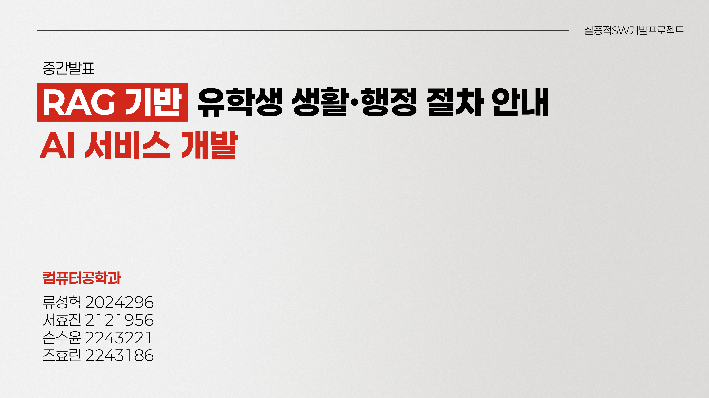
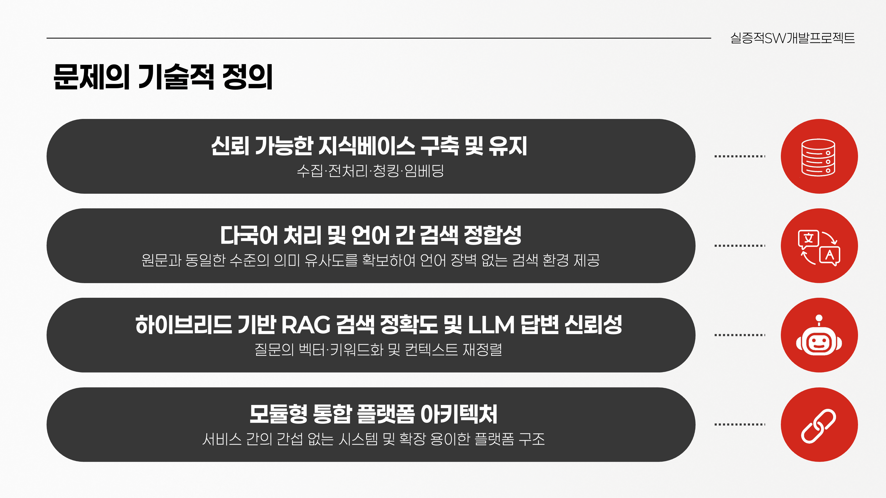
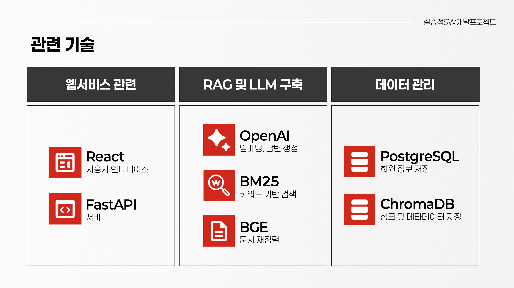
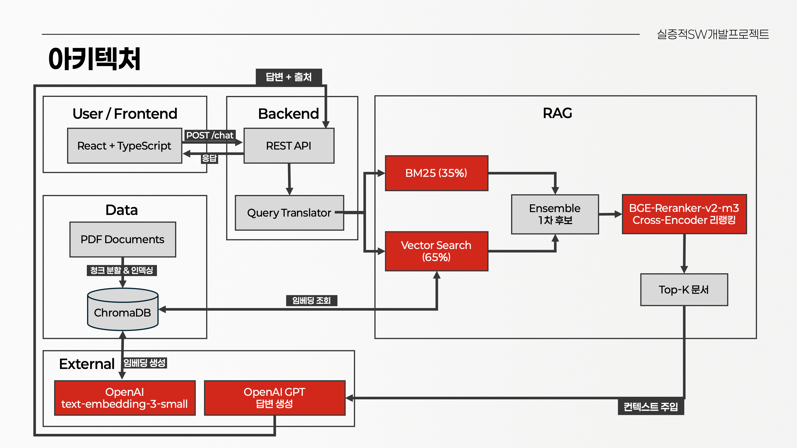
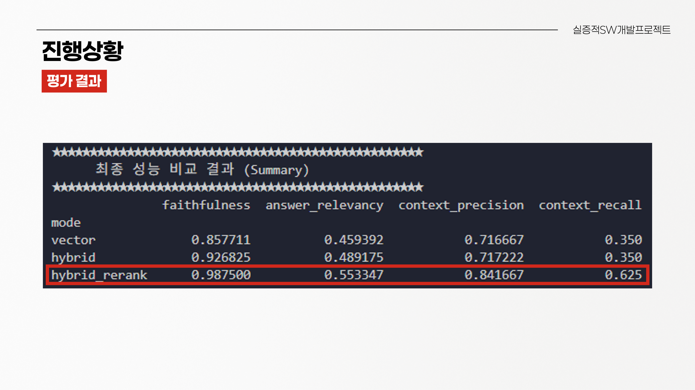

# 📚 RAG 기반 유학생 생활·행정 절차 안내 AI 서비스
한국 내 유학생이 겪는 언어 장벽과 행정 절차의 복잡성을 해소하기 위한 RAG 기반 다국어 챗봇 서비스를 개발 중입니다.

## ⚙️ 기술 스택

### Frontend
| 기술 | 용도 |
|------|------|
| React + TypeScript | 사용자 인터페이스 |

### Backend
| 기술 | 용도 |
|------|------|
| FastAPI | REST API 서버 |

### RAG & LLM
| 기술 | 용도 |
|------|------|
| OpenAI GPT | 답변 생성 |
| OpenAI text-embedding-3-small | 문서 및 쿼리 임베딩 |
| BM25 | 키워드 기반 검색 |
| BGE-Reranker-v2-m3 | Cross-Encoder 기반 문서 재정렬 |

### Database
| 기술 | 용도 |
|------|------|
| ChromaDB | 벡터 청크 및 메타데이터 저장 |
| PostgreSQL | 회원 정보 저장 |

## 🔬 RAG 파이프라인

### 1. Hybrid Search

단일 검색 방식의 한계를 극복하기 위해 두 가지 검색을 앙상블로 결합합니다.

```
질문 입력
   ├─ BM25 (35%)  → 키워드 기반 검색 (고유명사, 숫자, 정확한 용어 매칭에 강함)
   └─ Vector (65%) → 의미 기반 검색 (문맥 파악에 강함)
         ↓
     Ensemble → 1차 후보 Top-15 선정
```

### 2. Reranker

1차 후보 15개를 Cross-Encoder 방식으로 재평가하여 최종 Top-K 문서를 선정합니다.

```
Top-15 후보
    ↓
BGE-Reranker-v2-m3 (Cross-Encoder)
    ↓
Top-K 최종 문서 → GPT 컨텍스트 주입
```

---

## 📊 평가 (RAGAS)

ChromaDB에 저장된 청크를 활용한 **자문자답 방식**으로 평가 데이터셋을 구성하고, 아래 4가지 지표로 시스템을 측정합니다.

| 지표 | 설명 |
|------|------|
| **Faithfulness** (충실도) | 답변이 컨텍스트 내 내용만으로 작성되었는가 |
| **Answer Relevancy** (답변 관련성) | 답변이 질문의 의도에 부합하는가 |
| **Context Precision** (문맥 정확성) | 핵심 정보가 컨텍스트 상단에 배치되었는가 |
| **Context Recall** (문맥 재현율) | 정답 작성에 필요한 정보가 컨텍스트에 포함되었는가 |

## 관련 발표자료





