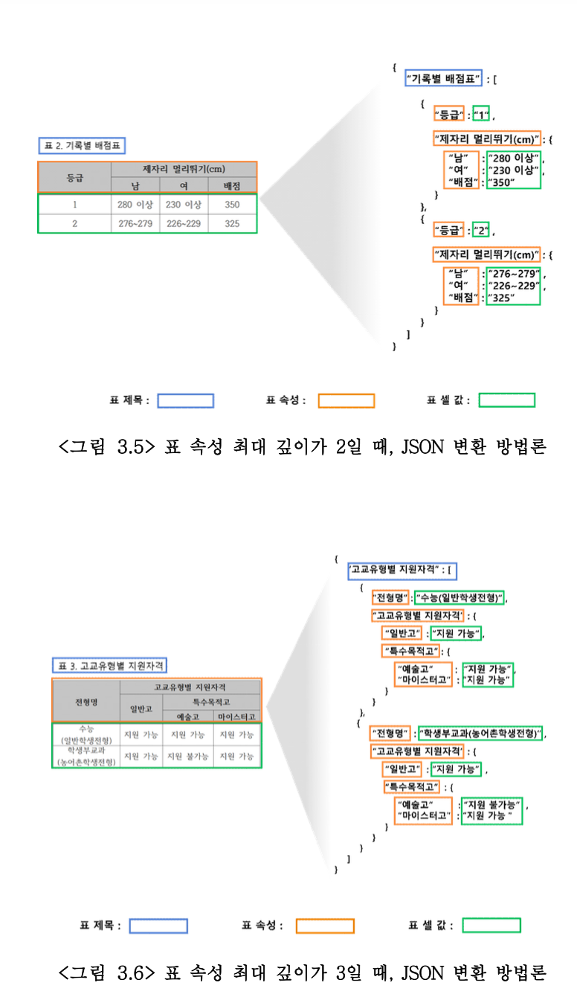
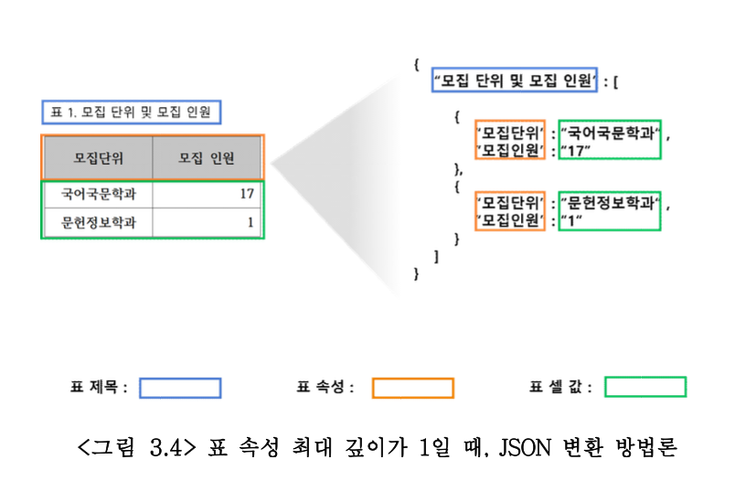

# [요약] 거대언어모델(LLM) 기반 질의응답 시스템의 표 데이터 이해도를 높이는 전처리 기법

1. 현재 문제점
    1. GPT 같은 주요 거대언어모델은 비정형 데이터를 학습하기 때문에 구조적인 형태를 가진 표를 다루는 데에는 상대적으로 낮은 성능을 보임 → 유학생들이 보는 pdf 문서에는 표 형태의 내용이 많이 담겨있음 
2. 제안하는 해결책
    1. 구분자 기반 전처리 기법 
        1. 여기에서도 해결되지 않은 문제점
        
        **1️⃣ 프로토타입의 한계:** 논문에서 구축한 현재 시스템은 테스트에 사용한 문서의 표들이 기껏해야 '속성 최대 깊이 3'까지만 존재했기 때문에, 딱 거기에 맞춰서 프로토타입으로 만들어진 상태. 깊이 1, 2, 3에 따라 중괄호나 대괄호, 슬래시(/) 등을 사용하도록 규칙을 짜둔 것.
        
        2️⃣ **깊이가 더 깊어질 때의 문제점:** 하지만 세상에는 속성 깊이가 4, 5, 6 이상으로 훨씬 복잡하게 얽힌 표들도 분명 존재할 수 있음. 만약 이런 표를 만나면 시스템은 4단계 이상의 깊이를 표현할 기호나 규칙을 모르기 때문에 에러가 나거나 인식을 못 하게 됨.
        
        3️⃣ **수동 업데이트의 늪:** 결국 깊이가 4인 표를 처리하려면 개발자가 4단계용 새로운 구분자를 추가하고, 이를 인식해 잘라주는 함수(코드)를 또 구현해야 함. 깊이가 5가 되면 또 새로 짜야 함.
        
    2. 한국어 조사 체계 기반 전처리 기법 
        
        <aside>
        💡
        
        이 연구에서는 띄어쓰기 단위로 문장을 분리하는 기본 BM25 검색기와 한국어 형태소 분석기인 Kiwi, Kkma, Okt, Komoran,Hannanum, Mecab을 각각 BM25에 결합하여 성능을 비교하였다. **실험 결과, Okt 형태소 분석기를사용했을 때 가장 우수한 성능**을보였다.
        
        </aside>
        
3. 실험 결과 및 결론 
    
    
    

<aside>
💡

**표 형태를 json 형식으로 바꾸기
json 형식으로 바꾼 말을 LLM이 더 잘 이해하도록 자연어로 바꾸기** 

</aside>
