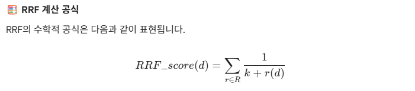
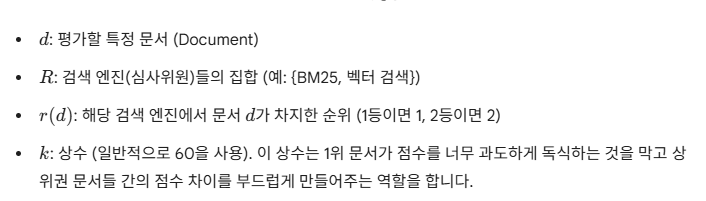
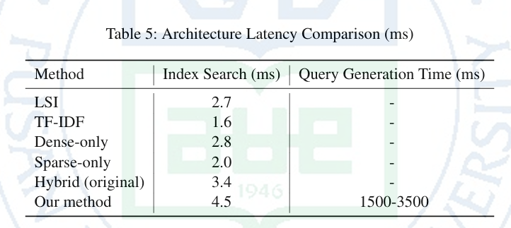

# [요약]Hybrid Multi-Expanded Query Framework for Information Retrieval in In-Domain Knowledge

저자: Fahmi Rizaldi
<br>
요약: 조효린
#### What is RRF ?
 https://velog.io/@acdongpgm/NLP.-Reciprocal-rank-fusion-RRF-%EC%9D%B4%ED%95%B4%ED%95%98%EA%B8%B0

1. 연구 배경
    1. 의미적 간극 (Semantic Gap) 문제 
    : RAG를 쓸 때 사용자는 간결한 질문을 하지만, 일반적인 문서들은 딱딱하고 전문적인 용어들이 많이 적혀있다. 
    2. 기존 RAG의 한계 
    : 사용자가 입력한 단 1개의 질문만 가지고 검색을 돌리거나, 일반적인 텍스트로만 학습된 임베딩 모델을 쓰면 언어를 2개 사용했을 때 이 두 언어 사이의 간극을 좁히지 못해 엉뚱한 문서를 찾아오는 경우가 많다. 
    
2. 세운 가설
    
    <aside>
    ❓
    
    사용자의 질문을 도메인 지식을 가진 LLM을 통해 여러 개의 구체적인 질문으로 **확장(Multi-query)**하고, 이를 키워드 검색(BM25)과 의미 검색(Vector)으로 **동시에 찾은 뒤(Hybrid)**, **RRF(순위 융합) 알고리즘**으로 합치면 기존의 단순 검색 방식보다 압도적으로 높은 검색 정확도를 보일 것이다.*
    
    </aside>
    
3. RRF

  > 
  > 
  > 
  > 하이브리드 검색에서는 키워드 일치 여부를 보는 BM25와, 의미적 유사도를 보는 벡터 검색(Dense Retrieval)을 함께 사용한다. 그런데 BM25의 점수는 10점, 20점 단위로 나오고 벡터 검색은 0.8, 0.9처럼 소수점으로 나온다. **점수 체계 자체가 달라서 점수를 그대로 더할 수가 없다.**
  > 
  > 그래서 **점수는 무시하고 오직 '순위(Rank)'만을 기준**으로 역수(Reciprocal)를 취해 더하는 방식이 바로 RRF. 상위권에 공통으로 랭크된 문서일수록 가산점을 강력하게 받아 최종 상위권에 오르게 됨.
  > 





```python
score = 0.0
for q in queries:
    if d in result(q):
  	    score += 1.0 / ( k + rank( result(q), d ) )
return score

# k는 순위에 대한 상수입니다.
# q는 질의(query)의 집합에서 하나의 질의를 의미합니다.
# d는 q의 결과 집합에서의 문서(document)를 나타냅니다.
# result(q)는 질의 q의 결과 집합을 의미합니다.
# rank(result(q), d)는 d가 result(q)에서의 순위를 나타냅니다. 순위는 1부터 시작합니다.
```

4. 실험 과정
  - **[실험 1] 베이스라인(비교군) 성능 측정:**
  가장 기본적인 검색 방식들의 성능을 먼저 측정합니다. 사용자의 원본 질문 딱 1개만 가지고 BM25(키워드 검색)만 돌렸을 때, 그리고 Dense(벡터 검색)만 돌렸을 때 문서를 얼마나 잘 찾아오는지(재현율, Recall 등) 점수를 매깁니다.
  - **[실험 2] 다중 질의 확장(Multi-Query Expansion) 효과 검증:**
  해당 전문 도메인 데이터로 추가 학습(Fine-tuning)을 시킨 LLM에 사용자의 질문을 넣습니다. LLM이 원본 질문과 의미가 비슷한 3~5개의 다른 질문들을 만들어내면, 이 여러 개의 질문으로 검색을 돌렸을 때 실험 1보다 성능이 얼마나 오르는지 확인합니다.
  - **[실험 3] 하이브리드 + RRF 융합 평가 (제안 모델):**
  실험 2에서 만들어진 여러 개의 질문들을 BM25와 벡터 검색 양쪽 모두에 던집니다. 쏟아져 나온 수많은 검색 결과들을 **RRF(Reciprocal Rank Fusion)** 공식에 넣어 순위 기반으로 공평하게 점수를 매긴 뒤, 최종 상위 문서를 뽑아냅니다.
  - **[실험 4] 평가지표(Metric) 분석:**
  최종적으로 실험 1(기본 방식)과 실험 3(제안 방식)의 정답률(Recall, NDCG 등) 수치를 비교하여, 제안한 모델이 실제로 얼마나 우수한지 객관적으로 평가합니다.

5. 결론


 
 - **가설 증명 성공:** 단일 질문이나 단일 검색 엔진을 썼을 때보다, 논문에서 제안한 **[다중 질의 확장 + 하이브리드 검색 + RRF] 프레임워크를 모두 결합했을 때 전문 도메인 환경에서 가장 뛰어난 검색 성능**을 기록했습니다.
 - **시너지 효과 입증:** 여러 개의 질문으로 확장하는 것은 사용자의 숨겨진 의도를 파악하는 데 도움을 주었고, RRF를 통한 하이브리드 융합은 정확한 단어가 일치해야 하는 문서(BM25 강점)와 문맥상 의미가 비슷한 문서(벡터 검색 강점)를 놓치지 않고 모두 잡아내는 완벽한 시너지를 냈습니다.
