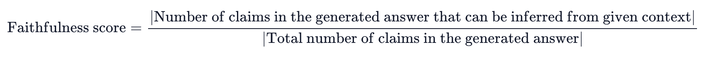
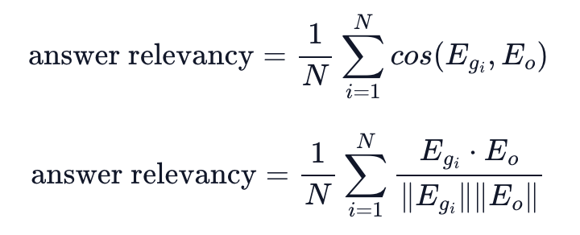
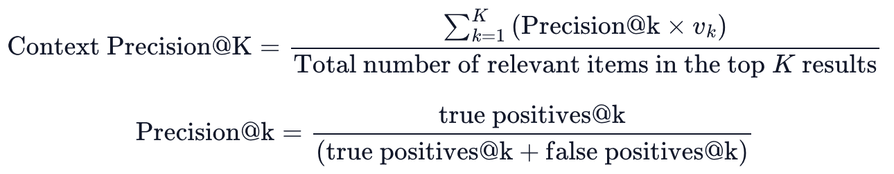

# [요약] Ragas: Automated Evaluation of Retrieval Augmented Generation

---

## 평가 전략

1. **충실도 (Faithfulness)**: 답변의 주장이 제공된 문맥에서 추론될 수 있는지를 측정하여 환각 방지 
    1. **측정법**: 답변을 여러 진술(Statements)로 쪼갠 뒤, 각 진술이 문맥에 의해 지원되는지 LLM이 검증
        
        
        
2. **답변 관련성 (Answer Relevance)**: 답변이 원래 질문에 얼마나 직접적이고 적절하게 답하는지 평가
    1. **측정법**: 답변을 기반으로 역으로 질문들을 생성한 뒤, 원래 질문과의 코사인 유사도 계산
        
        
        
3. **문맥 관련성 (Context Relevance)**: 검색된 문맥에 불필요한 정보가 얼마나 적은지 측정
    1. **측정법**: 질문에 답하는 데 꼭 필요한 문장들만 문맥에서 추출하여 전체 문장 수와의 비율 구함
        
        
        

## 데이터셋

1. **검증용 데이터**
    1. Ragas 지표가 사람의 판단과 얼마나 일치하는지 확인하기 위해, 2022년 이후의 위키피디아 페이지 50개를 기반으로 새로운 데이터셋 구축
2. **평가 일치도**
    1. 인간 평가자들 사이에서 충실도와 문맥 관련성은 약 **95%**, 답변 관련성은 약 **90%**의 높은 합의율

## 실험 결과 (Experiments)

1. **인간 판단과의 상관관계**: Ragas는 기존의 GPT Score나 GPT Ranking 방식보다 인간의 판단과 훨씬 더 높은 일치도(Accuracy) 보여줌
2. **지표별 성능**: 특히 **충실도(Faithfulness)** 항목에서 매우 정확한 예측 성능을 보였으며, 문맥 관련성은 긴 문맥에서 핵심을 뽑아내는 LLM의 한계로 인해 상대적으로 가장 어려운 과제로 보임.
